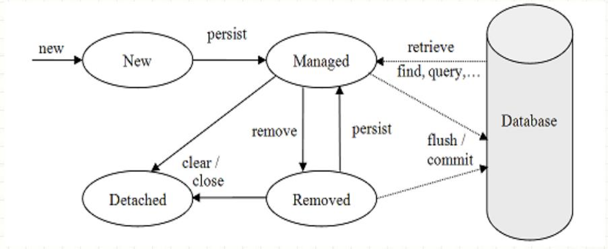

### Hibernate 
* Maps Java objects to database tables (part of Java Persistence ecosystem)
* Eliminates JDBC boilerplate code
* ORM maps: **Java classes → Tables**, **Java variables → Columns**, **Java objects → Rows**
* Benefits: Reduces SQL usage , Database-independent code

| Component                       | Description                      | Key Responsibilities                                                                      | Important Points                                                  |
| ------------------------------- | -------------------------------- | ----------------------------------------------------------------------------------------- | ----------------------------------------------------------------- |
| **Configuration**               | Starting point of Hibernate      | • Reads `hibernate.cfg.xml` • Loads DB details and mappings • Builds SessionFactory | • Created once • Immutable after creation                      |
| **SessionFactory**              | Factory for Session objects      | • Creates Session • Manages 2nd level cache • Holds DB metadata                     | • Heavyweight • Thread-safe • One per DB                    |
| **Session**                     | Represents a single unit of work | • CRUD operations • Manages persistent objects • Maintains 1st level cache          | • Lightweight • Not thread-safe • Short-lived               |
| **Transaction**                 | Logical unit of work             | • Begin, commit, rollback • Ensures data consistency                                   | • Supports JDBC & JTA • Ensures ACID properties                |
| **Query**                       | Executes HQL or SQL              | • Fetch/update data • Supports pagination & caching                                    | • DB independent (HQL) • Object-oriented                       |
| **Criteria API**                | Programmatic query mechanism     | • Builds dynamic queries • No hardcoded SQL                                            | • Type-safe • Easy for complex queries                         |
| **Persistent Objects (Entity)** | Java objects mapped to tables    | • Represent DB rows • Hold business data                                               | • Annotated with `@Entity` • POJO based                        |
| **Connection Pool**             | Manages DB connections           | • Reuses connections • Improves performance                                            | • Uses C3P0, HikariCP                                             |
| **Cache**                       | Stores frequently used data      | • Reduces DB calls • Improves performance                                              | • 1st level: Session scoped • 2nd level: SessionFactory scoped |
| **JDBC**                        | Low-level DB communication       | • Executes generated SQL                                                                  | • Hibernate internally uses JDBC                                  |

| Hibernate             | Spring Data JPA (auto configuration)         |
| --------------------- | ------------------------ |
| `Configuration`       | `application.properties` |
| `SessionFactory`      | `EntityManagerFactory`   |
| `Session`             | `EntityManager`          |
| HQL                   | JPQL                     |
| Hibernate Transaction | Spring `@Transactional`  |

* SessionFactory, Session, HQL, Hibernate Transaction are used by Spring data JPA underneath

#### General working
* Flush = Synchronize in-memory changes → Database SQL.
* Commit always triggers flush. Flush alone does not permanently save until commit.
* AUTO flush ensures JPQL queries always run on up-to-date database state
* Hibernate tracks changes to persistent entities. No need to write UPDATE SQL manually. (Active transaction & Entity must be persistent needed)
* **Write-behind **:  Hibernate buffers entity changes in the persistence context and writes them to the database later during flush or commit.
* the EntityManager is usually created and destroyed per transaction
* Repositories are transactional by default. Services usually control transactions with @Transactional
* We can use Hibernate alone instead of using Spring data JPA
* During transaction commit flush automatically happens
* persist(), flush(), merge(), remove(), refresh() methods require transaction compulsorily.  (TransactionRequiredException)
* em.merge(order) -> Creates a new copy and makes it Persistent, ID for order remains null since it is in detached state. 
* Merge is to sync new changes in same entry in DB meanwhile persist used for new entry in DB
* Use LAZY by default. Use EAGER only when always needed and small.

| Step             | JDBC / MyBatis   | JPA / Hibernate        |
| ---------------- | ---------------- | ---------------------- |
| Load data        | You write SELECT | JPA writes SELECT      |
| Change value     | Change variable  | Change entity field    |
| Write UPDATE SQL | You must         | ❌ Not needed           |
| Execute UPDATE   | You must         | JPA does automatically |
| Forget UPDATE    | No DB change     | DB still updates       |

#### Entity States

| State          | Description                                         |
| -------------- | --------------------------------------------------- |
| **Transient**  | New object, not associated with persistence context |
| **Persistent** | Managed by EntityManager, tracked for changes       |
| **Detached**   | Previously persistent, but EntityManager closed     |
| **Removed**    | Marked for deletion                                 |

Note : Manually setting an ID on a new entity makes it Detached, so persist() throws EntityExistsException

#### EntityManager

| Method      | Purpose                             | Requires Transaction |
| ----------- | ----------------------------------- | -------------------- |
| `persist()` | Insert new entity                   | ✅ Yes                |
| `merge()`   | Update detached entity / copy state | ✅ Yes                |
| `remove()`  | Delete entity                       | ✅ Yes                |
| `flush()`   | Sync persistence context → DB       | ✅ Yes                |
| `refresh()` | Reload from DB                      | ✅ Yes                |

| Step            | `persist(order)`      | `merge(order)`             |
| --------------- | --------------------- | -------------------------- |
| Initial State   | Transient             | Transient                  |
| Action          | Becomes persistent    | New managed copy created   |
| ID Assignment   | `order.id` gets value | Only copy gets ID          |
| Returned Object | Same instance         | Must use returned instance |

#### Hibernate Schema generation

| Value        | What Hibernate does internally                                   | Simple Example Effect                                                                 |
|--------------|------------------------------------------------------------------|----------------------------------------------------------------------------------------|
| none         | Does nothing with the schema                                     | Uses DB as-is; no checks, no changes                                                 |
| validate     | Compares entity mappings with DB schema and throws error if mismatch | If `orders.status` column is missing → app fails at startup                         |
| update       | Compares mapping vs DB and executes required ALTER statements    | If new field `createdAt` added → Hibernate runs `ALTER TABLE orders ADD created_at` |
| create       | Drops existing tables and recreates schema from entities        | Every restart wipes tables and creates fresh ones                                    |
| create-drop  | Same as create, plus drops tables when app stops                | Tables exist only while application is running                                       |

